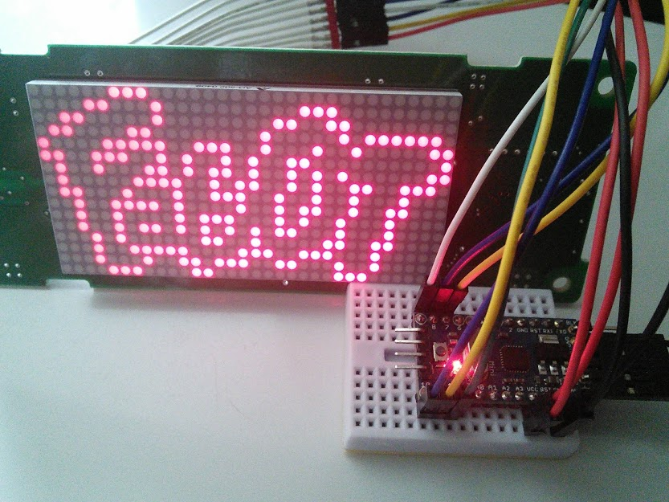

# FabOT 電光掲示板 
Arduinoとデジットの32x16ドットマトリクスLEDモジュールでFabOT電光掲示版を作ってみました。 
FabOTの活動につきましてはこちら( https://fablab-shinagawa.org/column/whatisot.html ) 
デジットの32x16ドットマトリクスLEDモジュールにつきましてはこちら（ http://blog.digit-parts.com/archives/51872590.html ） 

